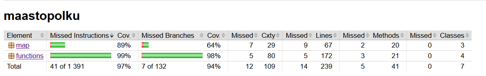

Ohjelma on testattu automaattisilla testeillä, jotka kattavat koko ohjelman suorituksen poislukien PathDrawer- ja Main-luokat. 
Jacocon avulla on mitattu testien kattauudeksi 75%. Tämä voi kuitenkin olla vähemmän epäillyn käyttöjärjestelmään liittyän ongelman vuoksi.

__Kattavusraportit:__

