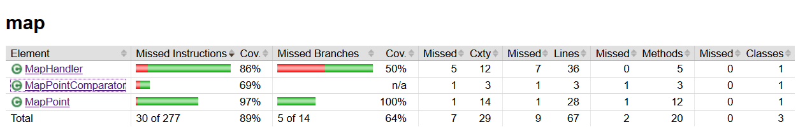

Ohjelma on testattu automaattisilla testeillä. Testit tarkastavat algoritmien oikeellisuuden, MapPoint-luokan toiminnan ja karttojen käsittelyn. 

Systems-paketin sisältämät luokat ovat jätetty testaamatta, sillä niiden toiminta on riippuvaista käyttöliittymistä.

Jacocon avulla on mitattu testien kattauudeksi 97%.

__Kattavusraportit:__

